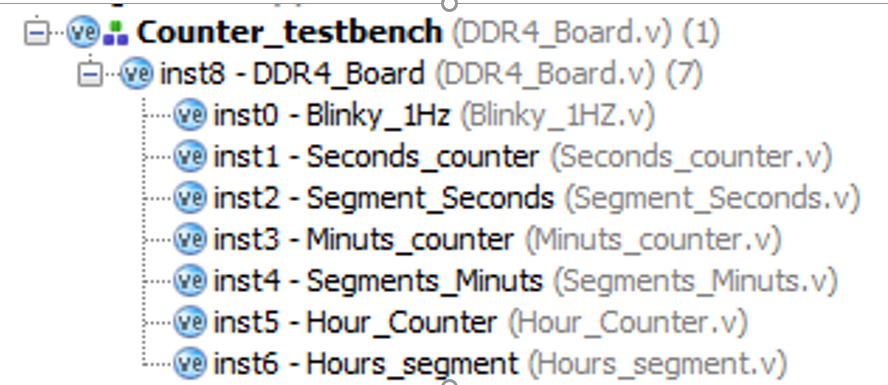
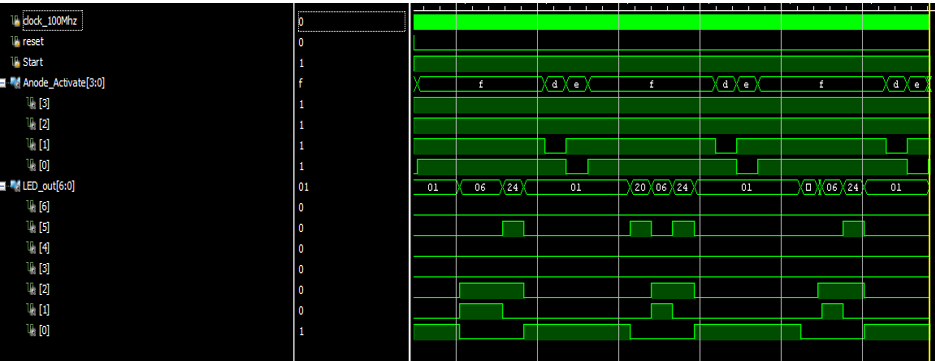
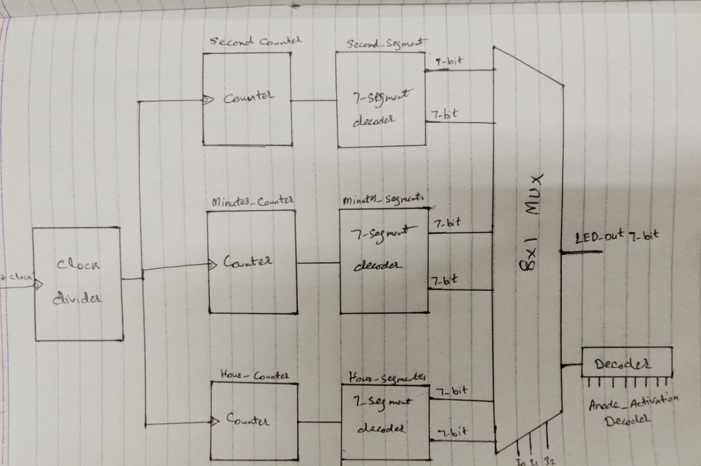

**#Stopwatch Using Xilinx DDR4 Design**

Video Link
https://www.youtube.com/watch?v=tO61o_u2CWE

◙ **Overview**
	
  This project is to design Stopwatch using Verilog Language and interface the design with Xilinx DDR4 hardware board. The very first step to design desire product, We need to calculate accurate time and we use that time in our further process to count second, minutes and hours. Furthermore, we decode the counting number to display on seven segments. We are using time multiplexing technique to real time display counting number on seven segment display. There are reset, stop and start button on hardware to control the process.

◙ **Introduction**
	
  Stopwatch is a special type of watch. It is used to calculate the time taken in a process or an activity. A stopwatch is different from other watches because in normal wristwatches, the time keeps moving whereas in stopwatches, the time starts from 00:00 and can be reset. 

◙ **Design Methodology**

**Clock Divider:**
	Clock divider is the very important component of our design because we need to calculate real time accuracy to count second, minutes and hours. So, Xilinx DDR4 board produce 100 MHz clock per second and we now that on positive edge clock it count two cycle for second positive edge clock detection. So, we need to count 50 MHz clock to count one second.

**Second, Minutes, Hours Counter:**
	This counter is using clock divider module to count 0 to 59 for seconds, 0 to 59 for minutes and 1 to 12 for hours.
To count one minute we are using first block output and we need two 6-bit register counter in which one of counter is counting 60 seconds and enable one bit, the other one counter is counting minutes when enable bit is one and one's counter value become zero. 
To count one hour we are using first block output and we need two register counter in which one counter is of 12-bits for counting 3600 seconds and enable one bit, the other one counter is 4-bit for counting hours when enable bit is one and one's counter value become zero.

**Seven Segments Decoder:**
	 We are using seven segment display to display real time seconds, minutes and hours. To display counter values on seven segment display we need decoder that will decode the value of counter into seven segment display at active low.

**Time Multiplexing and anode decoder:**
	Seven segment display of Xilinx DDR4 is not ordinary as we used in our previous system design. The cathode of every seven segment are connected together with active low and only anode of these seven segment display are connected individually.  So to accommodate of every seven segment we need time multiplexing that will on only one 7-segment at one time. This process will be as fast as humane eye can’t see and this time should be in between 1ms to 16ms. 

**Structurally working modules:**

**Simulation Results:**

**Design Top Module:**

**Conclusion:**

Concluding our project (Stopwatch) design with the help of clock divider for the second which is being displayed through 7 segment display of the Nexys 4 DDR and with the
same generating clock we also display the minutes through 7 seven segment and also same for the clock of the counter. After 50Mhz clock generation one second will be counting
in 7 seven segment display for second block and after 60 second there will be one counting in 7 segment display of the minute clock and same will be for hour display but 
there will be 3600 seconds required for one hour. To run seconds, minutes and hours on the same clock divider we use multiplexer which will decide that which counter should 
be changed after how many seconds. Two switches also used in stopwatch in which one will act is start and stop and the second switch uses as a reset button to reset all the 
segment to zero.

**TeamMembers:**

**Hamza Ashraf**
**Muhammad Awais Javed**
**Rohibullah**

**Instructor:**

**Dr.Safeer Hyder**
